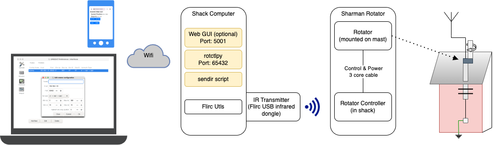
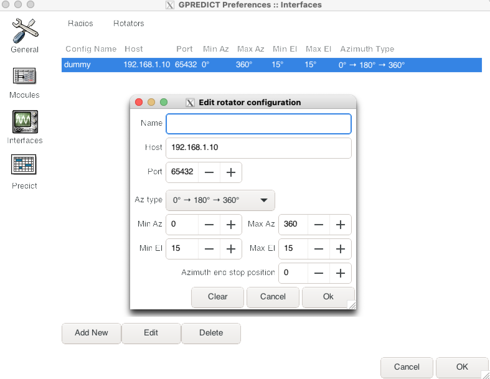
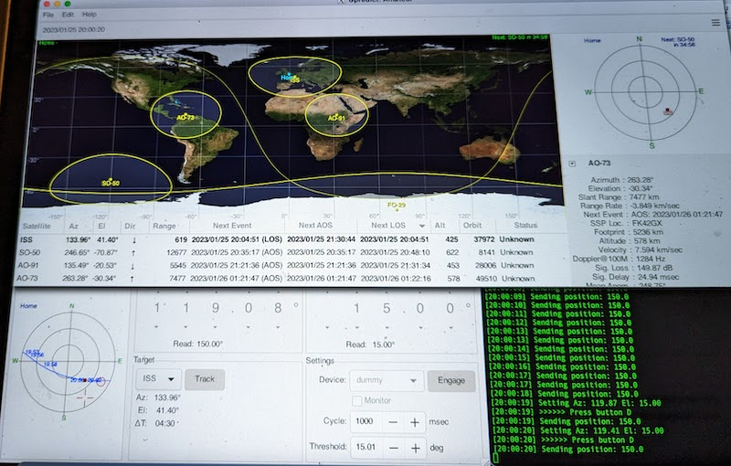

# hamlib rotctl implementation in python for infrared rotator

* Simple python script listening on port 65432 that accepts rotctl commands
* Can be used with tools such as [GPredict](http://gpredict.oz9aec.net/) 
* TV rotators like the [Sharman AR 600](https://moonrakeronline.com/sharman-ar-600-vhf-uhf-antenna-rotator) 
* Threshold for rotation should be set to > 15 degrees
* Script sendir.sh to interface with IRC such as [Flirc USB](https://flirc.com/more/flirc-usb)
* <a href="https://github.com/stevendodd/rotctlpy/releases">v0.2</a> contains lots of updates for Windows users

 
