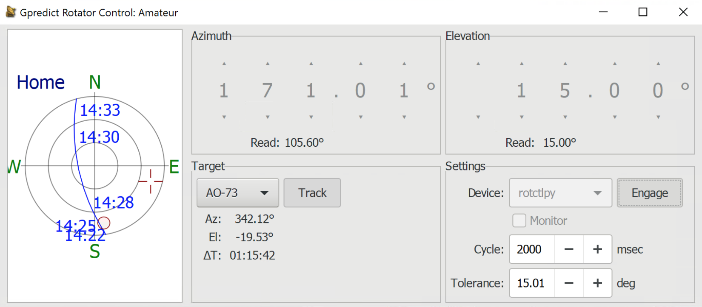

# hamlib rotctld for infrared rotator control

* A python implementation of rotctld that by default listens on port 65432 and accepts rotctl commands
* Can be used with tools such as [GPredict](http://gpredict.oz9aec.net/) 
* TV rotators like the [Sharman AR 600](https://moonrakeronline.com/sharman-ar-600-vhf-uhf-antenna-rotator) 
* Threshold for rotation should be set to > 15 degrees
* Invokes a script 'sendir' to interface with IRC such as the [Flirc USB](https://flirc.com/more/flirc-usb). Assumes Flirc binaries (irtools or Flirc_utils.exe) are added to the system PATH environment. Modify this script to output alternative commands.
* WebGUI originally written by Mark Jessop [rotctld-web-gui](https://github.com/darksidelemm/rotctld-web-gui); upgraded and modified 

### Block Diagram


### Example GPredict Integration


<p> 


### Optional Web GUI for testing 

Connect UI with -g flag on startup. Default address `http://localhost:5001`

> [!CAUTION] 
> Do not connect if controlling rotator via other software in parallel.


### Installing

Requires python3

```
pip install -r requirements.txt
```

### Running rotctlpy

```
python rotator.py
```

By default this will start the rotctldpy server on `localhost:65432` and listen for rotctl commands from other software, see the Gpredict example above.

In addition a webserver is started and available at `http://localhost:5001` This is used to host the WebGUI but will also accept http requests to invoke the sendir script, regardless of if the WebGUI is connected or not. For example `http://localhost:5001/A` will send the command linked to button A.

```
192.168.1.10: $ python rotator.py --help
usage: rotator.py [-h] [-l LISTEN_PORT] [-g] [-s HOST] [-p PORT]

optional arguments:
  -h, --help            show this help message and exit
  -l LISTEN_PORT, --listen_port LISTEN_PORT
                        Port to run Web Server on. (Default: 5001)
  -g, --gui             Connect WebGUI - warning do not use in parallel with other software to control rotator
  -s HOST, --host HOST  Rotctld server host. (Default: localhost)
  -p PORT, --port PORT  Rotctld server port. (Default: 65432)
  ```
  
### Home Assistant Integration

Can be integrated with Home Assistant using REST commands - see the examples in the home-assistant directory.

